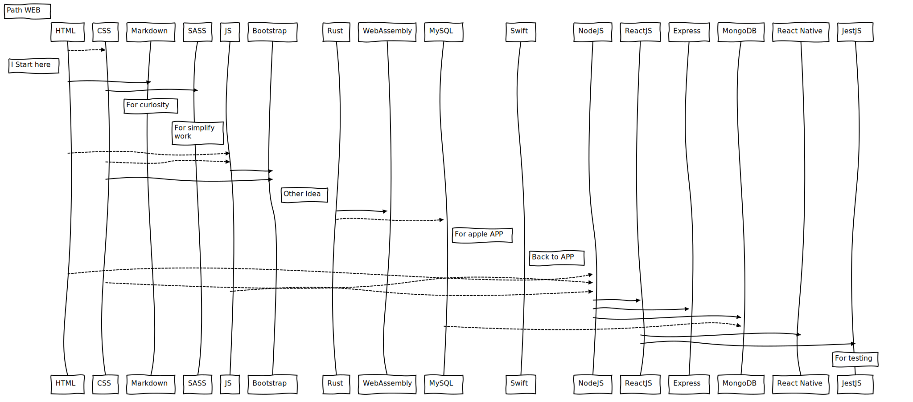

## 👋 Hi, I’m @alan-vidal

## 🧰 At Work
A self-described creative and determinate person, Alan is a professor who is committed to teaching Design driven-innovation and transmit the importance to detect and analyze problems as a strategy for development. He has spent the last 4 years creating an educational strategy and path to learn and apply design in the context of engineering for developing a new solution and is currently most passionate about the work he is doing to engage the student in your learning process through active methodologies for learning.

As a product design engineer turned professor, Alan has developed a unique perspective when it comes to education, innovation, and entrepreneurship. Influenced by real experiences and industrial analysis, he aspires to continue as a teacher and pass the knowledge on to more people in the next stage of his career.

## 🎓 From the University
Alan Vidal starts his academic path at school in Temuco, south of Chile, after that, he moves to Valparaiso to get a product design engineer degree from the University Tecnica Federico Santa Maria where he develops abilities like teamwork, creativity, strategic product development, and methodologies of design, during the university he work as a professor's assistant, in three- dimensional modeling courses, product design strategies and product workshop in different years. With the last college degree work Alan create a Spark Innovation Kit, a card-based game that allows you to analyze a problem from a new perspective.

When he finishes university he starts working company in the wood industry, where learn about the importance to work near to people and industrial process, one year later he starts like teacher fellow at Universidad Santa Maria and after that Universidad Adolfo Ibañez, where he working actually. During the last two year, Alan has completed the degrees of JAVA application programming analyst and Learning and Teaching at the University, understanding the importance of methodologies and processes for the development of transversal skills

## 🪛 Entrepreneurship
### > Spark Innovation Kit 2017 - present

Spark Kit is an interactive board game, which seeks to generate constructive work in pursuit of a solution related to a problem posed by the team.

This work is achieved given that Spark Kit has a structured methodological base, which through a sequence of steps, questions and suggestions seeks to guide the team to an innovative solution with a high creative component.

### > Puerto Studio 2016 - 2019

Puerto Studio was a consulting firm technology- based with a focus on improving the design process to add value to different products or services; we work in specific with a research center to modify a battery system for an electric car. We understood the complexity of creating new solutions and the importance of the process of design into industry

## 🪜 Software and Computer Skills

### Communication tools

- Google Hangouts
- Zoom
- Microsoft Teams
- Slack

### Spreadsheets

- Excel
- Google Sheets

### Word Processing and Desktop Publishing Tools

- Microsoft Office Suite
- Keynote and Page on macOS
- Google Docs

### Computer Programming

- HTML
- CSS
- SASS
- Markdown
- JavaScript
- Arduino/Processing

### Databases

- SQL

### Graphic Design

- Adobe Illustrator
- Adobe LightRoom
- Adobe XD
- Adobe iDesign
- Miro

### Three-dimensional modeling
- Autodedk Fusion 360
- Autodedk Inventor Profesional
- Cura
- Maya
- 3D Max 

## 👀 I’m interested in 

Now I am interested in improve my programing skill and learn new program language for create more interesting project

## 🌱 I’m currently learning

- [x] [HTML](https://developer.mozilla.org/es/docs/Web/HTML) 🧑‍💻👌
- [x] [CSS](https://developer.mozilla.org/es/docs/Web/CSS) 🧑‍💻👌
- [x] [SASS](https://sass-lang.com) 📚
- [x] [Markdown](https://www.markdownguide.org) 📚
- [x] [Jekyll](https://jekyllrb.com) 🧐 / [HUGO](https://gohugo.io) 📚
- [x] [JavaScript](https://developer.mozilla.org/es/docs/Web/JavaScript) 📚
- [ ] [TypeScript](https://www.typescriptlang.org)
- [x] [Bootstrap](https://getbootstrap.com) 📚
- [ ] [Rust](https://www.rust-lang.org)
- [ ] [Webassembly](https://webassembly.org)
- [ ] [Swift](https://www.apple.com/cl/swift/) 🧐
- [x] [MySQL](https://www.mysql.com/products/workbench/)📚
- [ ] [NodeJS](https://nodejs.org/en/)
- [ ] [ReactJS](https://es.reactjs.org)
- [ ] [Express](https://expressjs.com/es/)
- [ ] [MongoDB](https://www.mongodb.com)
- [ ] [React Native](https://reactnative.dev)
- [ ] [JestJS](https://jestjs.io)

[comment]: <> (
https://bramp.github.io/js-sequence-diagrams/
Title: Path WEB
HTML --> CSS:
Note left of HTML: I Start here
HTML -> Markdown:
CSS -> SASS:
Note over Markdown: For curiosity
Note over SASS: For simplify \n work
HTML --> JS:
CSS --> JS:
JS -> Bootstrap:
CSS -> Bootstrap:
Note left of Rust: Other Idea
Rust -> WebAssembly:
Rust --> MySQL:
Note left of Swift: For apple APP
Note left of NodeJS: Back to APP
HTML --> NodeJS:
CSS --> NodeJS:
JS --> NodeJS:
NodeJS -> ReactJS:
NodeJS -> Express:
NodeJS -> MongoDB:
MySQL --> MongoDB:
ReactJS -> React Native:
ReactJS -> JestJS:
Note over JestJS: For testing
)

### 🔨 Arduino

### 🛠 Raspberry

### 💻 links of interest

- [min CSS](https://www.toptal.com/developers/cssminifier/)
- Jekyll [Ruby and Rail](https://rubyonrails.org)
- HUGO [Go](https://go.dev)
- [Python](https://www.python.org)
- [Processing](https://processing.org)

> Why programing? I think the programing skill is a key for develop new project and "Humans need to be able to control the interaction between people and machines."

## 📫 How to reach me ...

https://www.linkedin.com/in/alanvidalc/
